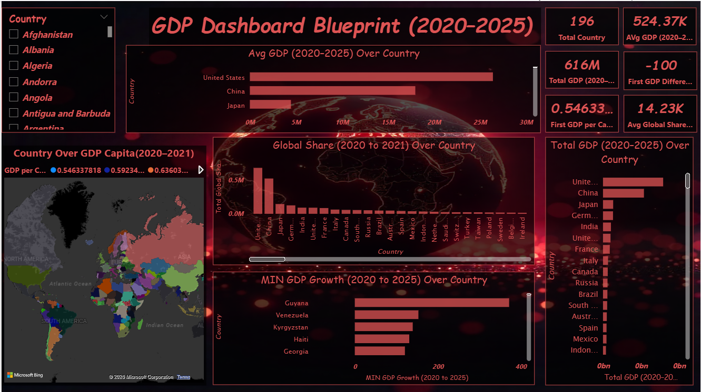

# GDP Dashboard Blueprint (2020–2025)

## Project Overview
This Power BI dashboard analyzes global GDP trends between 2020 and 2025.

## Features
- Total GDP analysis
- GDP growth tracking
- Global share comparison
- GDP per capita map visualization
- Interactive country filters

## Tools & Technologies
- Power BI
- DAX
- Power Query
- Data Modeling

## Dashboard Preview

## Insights
- United States leads in overall GDP
- China shows strong economic contribution
- Comparative country-level growth analysis
- Global economic distribution visualization

## Author
Gowtham T
